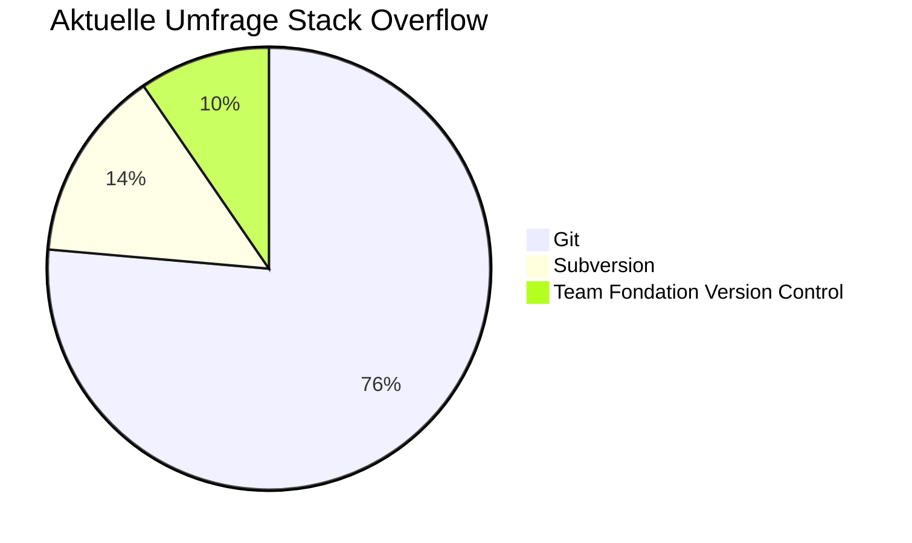

[toc]

# Title Git-Eine Einführung

# Bedingungen

- Dauer: 30 min
- Daumenregel

# Quellen

[entwickler.de](https://entwickler.de/dotnet/git-fur-einsteiger-wie-man-das-versionskontrollsystem-git-nutzt)

[Buch &#34;Pro Git&#34;](https://git-scm.com/book/en/v2)

[office](https://1drv.ms/p/s!Armzx7rBkL-1kXjlhWN9rxPJSwwi?e=ubbr3i)

# Mögliche Strukturierung

## Agenda

## Aktuelle Situation

- Bisher Dominanz

  - Team Foundation Version Control (TFVC) als ausgereiftes, stabiles System war gesetzt
  - Apache Subversion
- Aktuelle Umfrage des Entwicklerportal Stack Overflow

## Was ist Version Control?

## Unterschied zwischen Git und Subversion

## Wie speichert Git Daten ab

## Schnell, sicher, flexibel

### Branching

## Schwierigkeiten beim Umgang mit Git

## Nachteile

## Drei Schritte Plan zum Umstieg

## Quellen
